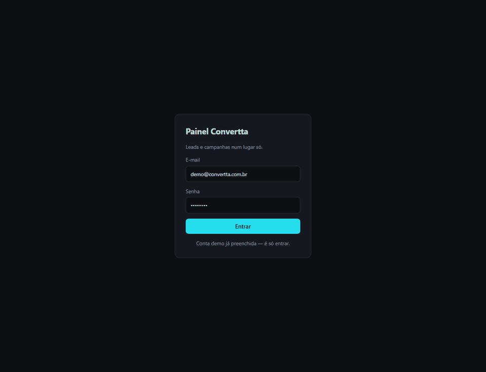
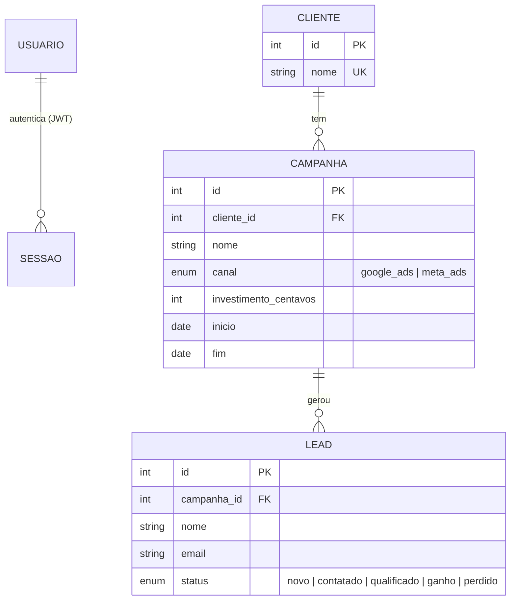

# Painel Convertta

**Leads e campanhas de tráfego pago dos clientes num lugar só, com custo por lead calculado.**

[](../../actions/workflows/ci.yml)
[](https://www.python.org/)
[](https://react.dev/)
[](https://www.typescriptlang.org/)
[](https://www.postgresql.org/)

Rodo tráfego pago para pequenos negócios. O acompanhamento vivia em três lugares —
o painel do Google Ads, o do Meta e uma planilha de leads — e a pergunta que o
cliente sempre faz, *"quanto está me custando cada lead?"*, exigia abrir os três e
fazer conta à mão. Este painel responde essa pergunta numa tela.

<!-- DEMONSTRAÇÃO — grave o GIF e descomente:

-->

**Conta demo:** `demo@convertta.com.br` / `demo1234` — já vem preenchida no
formulário. O banco é semeado com quatro clientes e quase 300 leads, então a
primeira tela já tem número.

## Subir em um comando

```bash
docker compose up --build
```

| | |
|---|---|
| Painel | http://localhost:5173 |
| API | http://localhost:8000 |
| Documentação da API (OpenAPI) | http://localhost:8000/docs |

O `compose` sobe o Postgres, espera ele aceitar conexão, roda as migrações,
semeia a conta demo e sobe a API e o front. Não há passo manual.

### Sem Docker

```bash
python -m venv .venv && source .venv/bin/activate   # Windows: .venv\Scripts\activate
pip install -r requirements.txt -r requirements-dev.txt
cp .env.example .env

alembic upgrade head
python -m scripts.semear
uvicorn app.main:app --reload

cd web && npm install && npm run dev
```

Sem `DATABASE_URL` definida, a API usa SQLite num arquivo local — o clone roda
sem serviço nenhum no ar.

## Escopo

**Três entidades, um painel, um login. Nada além disso.** Escopo que cresce é o
que mata projeto de portfólio: a versão que fica pronta vale mais que a versão
completa que nunca sobe.



## Decisões técnicas

**Dinheiro em centavos, sempre inteiro.** `float` erra por arredondamento
binário — 0,1 + 0,2 não dá 0,3 — e um relatório de investimento que fecha com um
centavo de diferença é um relatório em que ninguém confia. A conversão para reais
acontece só na borda, na hora de exibir.

**Sem lead, o custo por lead é `null`, não zero.** Dividir por zero não é "custo
zero"; é "ainda não dá para saber". R$ 0,00 leria como *conseguimos leads de
graça* — exatamente a leitura errada para quem está decidindo onde pôr verba. O
painel mostra um traço.

**O resumo é uma consulta, não um laço.** A versão ingênua busca os clientes e,
para cada um, volta ao banco atrás de campanhas e leads: 1 + 2N idas para N
clientes. E os leads entram por subconsulta, não no mesmo `join` do investimento —
juntar os dois multiplicaria o investimento de cada campanha pelo número de leads
dela. É o erro clássico de fan-out, e o tipo que só aparece depois de o número já
ter sido mostrado ao cliente. Tem teste com nome próprio para isso:
`test_duas_campanhas_nao_multiplicam_o_investimento`.

**Autenticação é estrutural, não repetida.** Toda rota de dados depende de
`usuario_atual`; não existe caminho que leia ou escreva sem token válido. E um
teste percorre as rotas registradas no app e reprova se alguma `/api/` nova ficar
de fora da lista de rotas fechadas — porque a checagem que se escreve à mão é a
que se esquece de escrever.

**E-mail inexistente e senha errada devolvem a mesma resposta.** Mensagens
diferentes contam a quem tenta invadir quais e-mails existem no sistema. Também
tem teste.

**Unicidade é do banco, não de um `SELECT` antes do `INSERT`.** Checar antes
perde a corrida quando duas requisições chegam juntas; a constraint não perde. A
rota trata o `IntegrityError` e devolve 409.

**Quem cria esquema é o Alembic, e só ele.** O script de seed não chama
`create_all`: dois donos do esquema é como se chega em produção com uma coluna
que existe na máquina de quem escreveu e não existe no servidor.

**TypeScript em modo estrito, não TypeScript de fachada.** Com `strict` e
`noUncheckedIndexedAccess` desligados sobra a sintaxe e some a verificação —
`any` implícito em toda parte, e o compilador deixa passar exatamente o que ele
existe para pegar. O contrato da API vive num arquivo só (`src/tipos.ts`), e
`custo_por_lead_centavos` é `number | null`, não opcional: a API sempre manda o
campo, e `null` significa "campanha ainda sem lead". Marcar como opcional
apagaria a diferença entre "não veio" e "não dá para saber ainda" — que é
justamente a distinção que este painel faz questão de mostrar.

## Testes

```bash
pytest
```

43 testes. Cada um recebe um banco vazio, então o resultado não depende da ordem
de execução — a categoria de defeito mais cara de diagnosticar numa suíte.

**A CI roda a mesma suíte contra Postgres 17**, em serviço próprio, e verifica que
as migrações sobem num banco vazio. Testar em SQLite e publicar em Postgres é
ensaiar num palco e estrear em outro: cascata de chave estrangeira, tipos e
transação se comportam diferente, e a diferença só aparece no ar. O front tem job
próprio, que roda `tsc --noEmit` em modo estrito antes de empacotar e quebra
se o build de produção quebrar.

## Estrutura

```
app/
├── main.py          monta a aplicação e o CORS
├── config.py        tudo que muda entre máquina, CI e deploy
├── db.py            engine e sessão por requisição
├── models.py        as três entidades
├── schemas.py       o que entra e o que sai pela rede
├── seguranca.py     bcrypt e JWT
├── dependencias.py  a dependência que fecha as rotas
└── rotas/           auth, clientes, campanhas, leads, painel

migrations/          Alembic — único dono do esquema
scripts/semear.py    conta demo e dados plausíveis, idempotente
tests/               43 testes
web/                 React + TypeScript (strict) + Vite
├── src/tipos.ts     o contrato da API, escrito uma vez
└── src/api.ts       o único lugar que fala com o back-end
```

## Deploy

Feito para Render ou Railway no plano gratuito: `Dockerfile` na raiz, `DATABASE_URL`
e `SEGREDO_JWT` vindos das variáveis do painel, `alembic upgrade head` no comando de
release e `/api/saude` para o healthcheck. O front é estático — `npm run build`
gera `web/dist/`.

Gere o segredo de produção; não use o do exemplo:

```bash
python -c "import secrets; print(secrets.token_urlsafe(48))"
```

## Licença

MIT.
